# 🚁 AURA DRONE DELIVERY — COMPLETE SYSTEM DESIGN
### *"Blinkit, but with Drones"*

> **Version:** 1.0  
> **Date:** May 2026  
> **Team:** AURA Engineering  

---

## TABLE OF CONTENTS

1. [Business Model & Vision](#1-business-model--vision)
2. [System Overview — All Applications](#2-system-overview--all-applications)
3. [High-Level Architecture](#3-high-level-architecture)
4. [Deployment Architecture](#4-deployment-architecture)
5. [Database Design (ER Diagram)](#5-database-design-er-diagram)
6. [Backend Microservices & API Design](#6-backend-microservices--api-design)
7. [Communication Protocols](#7-communication-protocols)
8. [User App — Screens & Flow](#8-user-app--screens--flow)
9. [Shopkeeper App — Screens & Flow](#9-shopkeeper-app--screens--flow)
10. [Admin GCS Dashboard](#10-admin-gcs-dashboard)
11. [Drone Edge System (Python)](#11-drone-edge-system-python)
12. [Complete Order Lifecycle — Sequence Diagram](#12-complete-order-lifecycle--sequence-diagram)
13. [Fleet Management & Dispatch Algorithm](#13-fleet-management--dispatch-algorithm)
14. [Class Diagram — Backend Domain Models](#14-class-diagram--backend-domain-models)
15. [State Machine — Order States](#15-state-machine--order-states)
16. [State Machine — Drone States](#16-state-machine--drone-states)
17. [Security Architecture](#17-security-architecture)
18. [Scalability & Future Roadmap](#18-scalability--future-roadmap)

---

## 1. BUSINESS MODEL & VISION

### How it works (Blinkit/Rapido analogy)

| Blinkit / Rapido             | AURA Drone Delivery                          |
|------------------------------|----------------------------------------------|
| Customer orders via app      | Customer orders via AURA App                 |
| Order goes to nearest store  | Order goes to nearest registered shop         |
| Rider picks up from store    | Drone autonomously flies to shop's SkyLink   |
| Rider drives to customer     | Drone flies to customer's nearest SkyLink    |
| Customer receives at door    | Customer collects from SkyLink Port           |
| Rider goes back/takes next   | Drone auto-returns to base / charging pad    |

### Key Differentiators
- **No traffic dependency** — Drones fly direct routes
- **Sub-15-minute delivery** — Within 5km radius
- **50km operational radius** — Using 4G/LTE + RTK GPS
- **cm-level precision landing** — Using UWB anchors at SkyLink ports
- **Autonomous fleet** — No human pilot needed per delivery

### Stakeholders
```
┌─────────────┐  ┌──────────────┐  ┌──────────────┐  ┌──────────────┐
│   CUSTOMER   │  │  SHOPKEEPER  │  │    ADMIN     │  │    DRONE     │
│   (User App) │  │ (Shop Panel) │  │  (GCS Panel) │  │  (Hardware)  │
└──────┬───────┘  └──────┬───────┘  └──────┬───────┘  └──────┬───────┘
       │                 │                 │                 │
       └────────── ALL CONNECT TO CENTRAL BACKEND ──────────┘
```

---

## 2. SYSTEM OVERVIEW — ALL APPLICATIONS

```mermaid
graph TB
    subgraph "📱 Client Applications"
        UA["👤 User App<br/>(React / React Native)<br/>Browse → Order → Track → Collect"]
        SK["🏪 Shopkeeper App<br/>(React Tablet App)<br/>Accept → Pack → Load → Dispatch"]
        AD["🎖️ Admin GCS Dashboard<br/>(React Web App)<br/>Monitor → Control → Override → Analytics"]
    end

    subgraph "☁️ Cloud Backend"
        GW["🔀 API Gateway<br/>(Nginx / Express Gateway)"]
        AUTH["🔐 Auth Service"]
        ORD["📦 Order Service"]
        SHOP["🏪 Shop & Catalog Service"]
        FLEET["🚁 Fleet Management Service"]
        PAY["💳 Payment Service"]
        NOTIF["🔔 Notification Service"]
        WS["⚡ WebSocket Hub"]
        MQTT["📡 MQTT Broker<br/>(Mosquitto / AWS IoT)"]
    end

    subgraph "💾 Data Layer"
        MONGO[("🗄️ MongoDB<br/>Orders, Users, Shops")]
        REDIS[("⚡ Redis<br/>Geo, Cache, Queues")]
        S3["📁 S3 / Cloud Storage<br/>Images, Logs"]
    end

    subgraph "🤖 Drone Hardware"
        PI["🍓 Raspberry Pi<br/>(Companion Computer)"]
        FC["🎮 Flight Controller<br/>(Pixhawk via MAVLink)"]
        CAM["📷 Cameras (×2)<br/>(RTSP Streams)"]
        UWB["📡 UWB Receiver<br/>(Precision Landing)"]
        LTE["📶 JioFi 4G/LTE<br/>(Internet)"]
    end

    UA <-->|REST + WS| GW
    SK <-->|REST + WS| GW
    AD <-->|REST + WS| GW

    GW --> AUTH & ORD & SHOP & FLEET & PAY & NOTIF
    AUTH & ORD & SHOP & FLEET --> MONGO
    FLEET --> REDIS
    NOTIF --> REDIS

    GW <--> WS
    FLEET <--> MQTT

    PI <-->|MQTT (4G/LTE)| MQTT
    PI <-->|MAVLink Serial| FC
    PI --- CAM
    PI --- UWB
    PI --- LTE
```

---

## 3. HIGH-LEVEL ARCHITECTURE

### Architecture Style: **Event-Driven Modular Monolith** (→ Microservices later)

We start with a modular monolith where each "service" is a separate module/folder within a single Node.js process. This gives us:
- ✅ Simple deployment (1 server)
- ✅ Easy debugging
- ✅ Clean boundaries for future split into microservices

```
Backend/
├── server.js                    # Express entry point
├── config/
│   ├── db.js                    # MongoDB connection
│   ├── redis.js                 # Redis connection
│   └── mqtt.js                  # MQTT broker connection
├── middleware/
│   ├── auth.js                  # JWT verification
│   ├── rbac.js                  # Role-based access control
│   └── rateLimiter.js           # API rate limiting
├── modules/
│   ├── auth/                    # 🔐 Authentication & Authorization
│   │   ├── auth.controller.js
│   │   ├── auth.service.js
│   │   ├── auth.routes.js
│   │   └── auth.model.js        # User schema
│   ├── order/                   # 📦 Order Management
│   │   ├── order.controller.js
│   │   ├── order.service.js
│   │   ├── order.routes.js
│   │   └── order.model.js
│   ├── shop/                    # 🏪 Shop & Catalog
│   │   ├── shop.controller.js
│   │   ├── shop.service.js
│   │   ├── shop.routes.js
│   │   ├── shop.model.js
│   │   └── product.model.js
│   ├── fleet/                   # 🚁 Fleet & Drone Management
│   │   ├── fleet.controller.js
│   │   ├── fleet.service.js
│   │   ├── fleet.routes.js
│   │   ├── drone.model.js
│   │   └── telemetry.model.js
│   ├── payment/                 # 💳 Payment
│   │   ├── payment.controller.js
│   │   ├── payment.service.js
│   │   └── payment.routes.js
│   ├── notification/            # 🔔 Push Notifications
│   │   ├── notification.service.js
│   │   └── notification.routes.js
│   └── skylink/                 # 📍 SkyLink Port Registry
│       ├── skylink.controller.js
│       ├── skylink.service.js
│       ├── skylink.routes.js
│       └── skylink.model.js
├── websocket/
│   └── wsHub.js                 # WebSocket event hub
├── mqtt/
│   ├── mqttHandler.js           # MQTT message handler
│   └── topics.js                # MQTT topic definitions
└── utils/
    ├── haversine.js             # Distance calculation
    ├── generateOrderId.js       # Unique order IDs
    └── logger.js                # Winston logger
```

---

## 4. DEPLOYMENT ARCHITECTURE

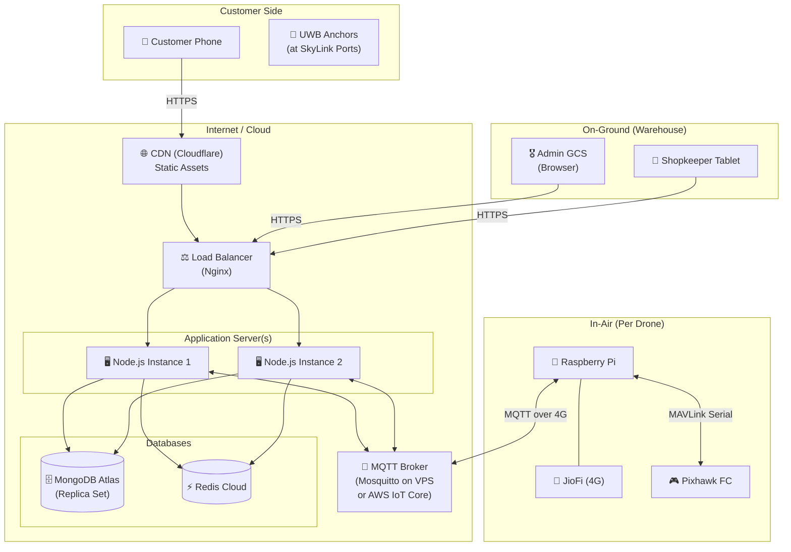

---

## 5. DATABASE DESIGN (ER DIAGRAM)

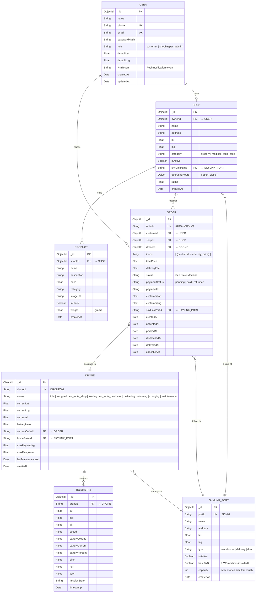

---

## 6. BACKEND MICROSERVICES & API DESIGN

### 6.1 Auth Service

| Method | Endpoint              | Description              | Access       |
|--------|-----------------------|--------------------------|-------------|
| POST   | `/api/auth/register`  | Register new user        | Public       |
| POST   | `/api/auth/login`     | Login → JWT token        | Public       |
| POST   | `/api/auth/refresh`   | Refresh JWT              | Authenticated|
| GET    | `/api/auth/me`        | Get current user profile | Authenticated|
| PATCH  | `/api/auth/me`        | Update profile           | Authenticated|
| POST   | `/api/auth/fcm-token` | Save FCM push token      | Authenticated|

### 6.2 Shop & Catalog Service

| Method | Endpoint                        | Description                    | Access      |
|--------|---------------------------------|--------------------------------|-------------|
| GET    | `/api/shops`                    | List shops near user (geo)     | Customer    |
| GET    | `/api/shops/:id`                | Shop details                   | Customer    |
| GET    | `/api/shops/:id/products`       | Products in a shop             | Customer    |
| POST   | `/api/shops`                    | Register new shop              | Shopkeeper  |
| PATCH  | `/api/shops/:id`                | Update shop details            | Shopkeeper  |
| POST   | `/api/shops/:id/products`       | Add product                    | Shopkeeper  |
| PATCH  | `/api/products/:id`             | Update product                 | Shopkeeper  |
| DELETE | `/api/products/:id`             | Remove product                 | Shopkeeper  |

### 6.3 Order Service

| Method | Endpoint                        | Description                    | Access      |
|--------|---------------------------------|--------------------------------|-------------|
| POST   | `/api/orders`                   | Place new order                | Customer    |
| GET    | `/api/orders/:id`               | Get order details              | Authenticated|
| GET    | `/api/orders/my`                | Customer's order history       | Customer    |
| GET    | `/api/orders/shop/:shopId`      | Orders for a shop              | Shopkeeper  |
| PATCH  | `/api/orders/:id/accept`        | Shopkeeper accepts order       | Shopkeeper  |
| PATCH  | `/api/orders/:id/packed`        | Mark order packed              | Shopkeeper  |
| PATCH  | `/api/orders/:id/loaded`        | Drone loaded, ready to fly     | Shopkeeper  |
| PATCH  | `/api/orders/:id/cancel`        | Cancel order                   | Customer/Admin|
| GET    | `/api/orders/active`            | All active orders (GCS)        | Admin       |

### 6.4 Fleet Management Service

| Method | Endpoint                        | Description                    | Access      |
|--------|---------------------------------|--------------------------------|-------------|
| GET    | `/api/fleet/drones`             | List all drones                | Admin       |
| GET    | `/api/fleet/drones/:id`         | Drone status                   | Admin       |
| POST   | `/api/fleet/drones`             | Register new drone             | Admin       |
| PATCH  | `/api/fleet/drones/:id`         | Update drone status            | Admin       |
| GET    | `/api/fleet/drones/:id/telemetry`| Latest telemetry              | Admin       |
| GET    | `/api/fleet/available`          | Find nearest idle drone        | Internal    |
| POST   | `/api/fleet/dispatch`           | Dispatch drone for order       | Internal    |
| POST   | `/api/fleet/abort/:droneId`     | Emergency abort (RTL)          | Admin       |

### 6.5 SkyLink Port Service

| Method | Endpoint                        | Description                    | Access      |
|--------|---------------------------------|--------------------------------|-------------|
| GET    | `/api/skylink/ports`            | List all ports                 | Public      |
| GET    | `/api/skylink/nearest`          | Find nearest port to lat/lng   | Customer    |
| POST   | `/api/skylink/ports`            | Register new port              | Admin       |
| PATCH  | `/api/skylink/ports/:id`        | Update port                    | Admin       |

### 6.6 Payment Service

| Method | Endpoint                        | Description                    | Access      |
|--------|---------------------------------|--------------------------------|-------------|
| POST   | `/api/payment/initiate`         | Create payment (Razorpay/Stripe)| Customer   |
| POST   | `/api/payment/verify`           | Verify payment callback        | Webhook     |
| GET    | `/api/payment/:orderId`         | Payment status                 | Customer    |

---

## 7. COMMUNICATION PROTOCOLS

### 7.1 Who talks to whom?

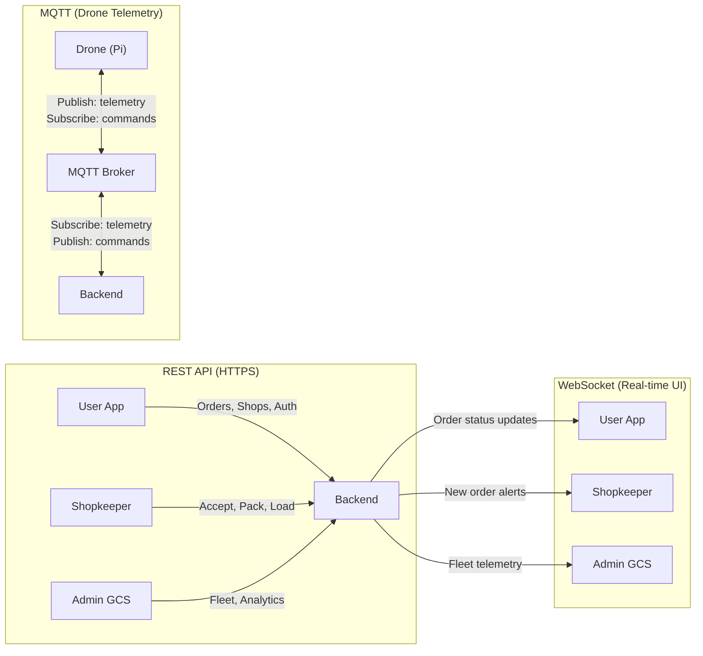

### 7.2 MQTT Topics

```
aura/drone/{droneId}/telemetry        ← Drone PUBLISHES every 1s
                                         { lat, lng, alt, battery, speed, pitch, roll, yaw, missionState }

aura/drone/{droneId}/command           → Backend PUBLISHES commands
                                         { action: "goto_shop" | "goto_customer" | "return_base" | "abort" | "land",
                                           targetLat, targetLng, targetAlt, orderId }

aura/drone/{droneId}/status            ← Drone PUBLISHES state changes
                                         { status: "idle" | "armed" | "taking_off" | ... , timestamp }

aura/drone/{droneId}/ack               ← Drone PUBLISHES command acknowledgments
                                         { commandId, result: "accepted" | "rejected", reason }

aura/fleet/heartbeat                   ← All drones PUBLISH every 5s
                                         { droneId, batteryLevel, status }
```

### 7.3 WebSocket Events

```
SERVER → CLIENT:
  "order:status_update"      → { orderId, status, droneId, eta }
  "order:new"                → { orderId, items, shopId }          (to shopkeeper)
  "drone:telemetry"          → { droneId, lat, lng, alt, battery } (to admin/user tracking)
  "drone:status_change"      → { droneId, oldStatus, newStatus }   (to admin)
  "notification"             → { title, body, type }

CLIENT → SERVER:
  "join:order:{orderId}"     → Subscribe to order updates
  "join:shop:{shopId}"       → Subscribe to shop's incoming orders
  "join:fleet"               → Subscribe to all fleet telemetry (admin only)
```

---

## 8. USER APP — SCREENS & FLOW

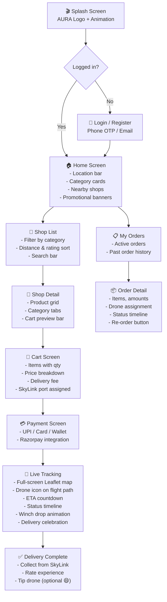

### User App Tech Stack
| Layer      | Technology                         |
|------------|-----------------------------------|
| Framework  | React (Vite) or React Native      |
| Styling    | Tailwind CSS                       |
| Animations | Framer Motion                      |
| Maps       | React-Leaflet / Mapbox GL          |
| State      | React Context + useReducer         |
| HTTP       | Axios                              |
| WebSocket  | socket.io-client                   |
| Payment    | Razorpay Web SDK                   |

---

## 9. SHOPKEEPER APP — SCREENS & FLOW

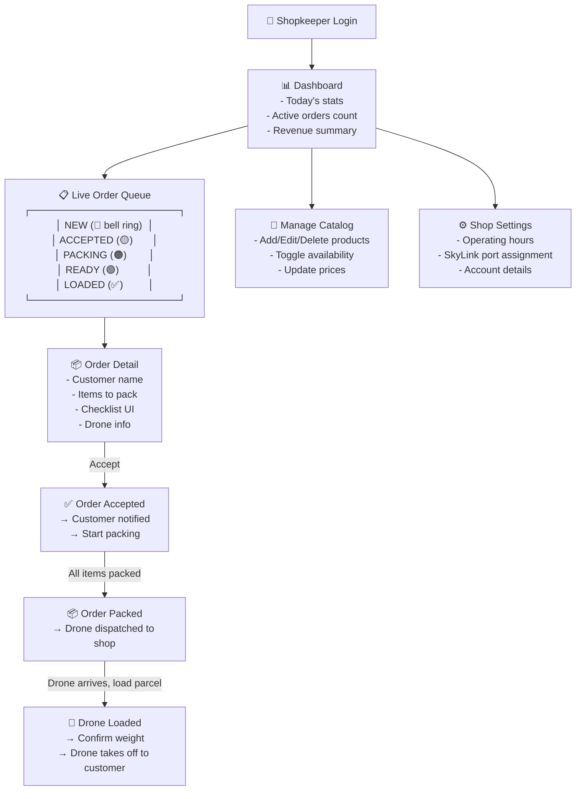

### Shopkeeper App Features
| Feature                | Description |
|------------------------|-------------|
| **Real-time alerts**   | WebSocket push when new order arrives — loud notification sound |
| **Order queue**        | Kanban-style board: New → Accepted → Packing → Ready → Loaded |
| **Item checklist**     | Tap each item as it's packed — prevents missed items |
| **Drone status**       | See assigned drone, ETA to shop, battery level |
| **Load confirmation**  | Physical scan/tap to confirm parcel on drone. Triggers takeoff |
| **Daily analytics**    | Orders completed, revenue, avg prep time |

---

## 10. ADMIN GCS DASHBOARD

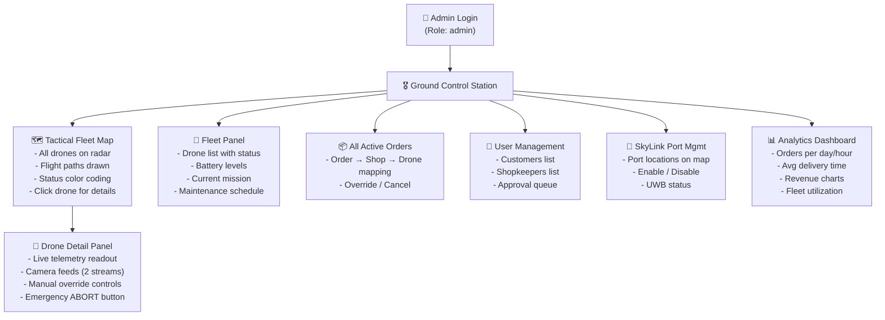

### GCS Tech Details
| Feature              | Implementation |
|----------------------|---------------|
| **Radar map**        | Leaflet + CSS `invert/hue-rotate` filter for tactical look |
| **Live drone icons** | Custom Leaflet markers, rotated by yaw angle |
| **Telemetry stream** | WebSocket from backend (bridged from MQTT) |
| **Camera feeds**     | `` tag pointing to Pi's Flask MJPEG endpoint |
| **Emergency abort**  | POST `/api/fleet/abort/:droneId` → MQTT → Drone switches to STABILIZE |

---

## 11. DRONE EDGE SYSTEM (PYTHON)

### Architecture on Raspberry Pi

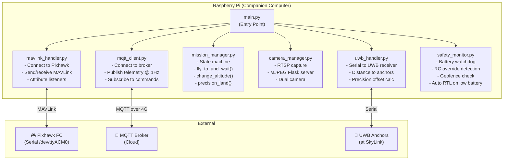

### Drone Mission State Machine

```
IDLE → ARMED → TAKING_OFF → FLYING_TO_SHOP → HOVERING_AT_SHOP
→ LOADING → FLYING_TO_CUSTOMER → DESCENDING → DELIVERING (servo)
→ CLIMBING → RETURNING_HOME → LANDING → IDLE
```

At ANY point: RC Override → ABORT (STABILIZE, pilot takes over)

---

## 12. COMPLETE ORDER LIFECYCLE — SEQUENCE DIAGRAM

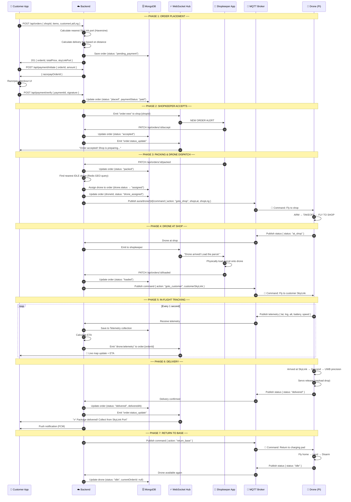

---

## 13. FLEET MANAGEMENT & DISPATCH ALGORITHM

### Finding the Best Drone

```
INPUT:  shopLat, shopLng (order's shop location)
OUTPUT: bestDrone (nearest idle drone with sufficient battery)

ALGORITHM:
  1. Query Redis GEO for all drones within 10km of shop
     → GEORADIUS drones:locations shopLng shopLat 10 km ASC

  2. Filter: status === "idle" AND batteryLevel >= 40%

  3. Sort by:
     a. Distance to shop (ascending)     — primary
     b. Battery level (descending)       — secondary

  4. Pick drone[0] → Assign to order

  5. If no drones available:
     → Queue order (Redis FIFO queue)
     → Notify admin via WebSocket
     → Notify customer: "All drones busy, ETA ~X min"

  6. When any drone becomes idle:
     → Pop from queue → Auto-dispatch
```

### Redis Geospatial Commands Used

```bash
# Store drone location (updated from MQTT telemetry)
GEOADD drones:locations 78.2210 30.0133 "DRONE001"

# Find drones near shop
GEORADIUS drones:locations 78.2200 30.0125 10 km ASC COUNT 5

# Calculate distance
GEODIST drones:locations "DRONE001" "SHOP_SKL02" km
```

---

## 14. CLASS DIAGRAM — BACKEND DOMAIN MODELS

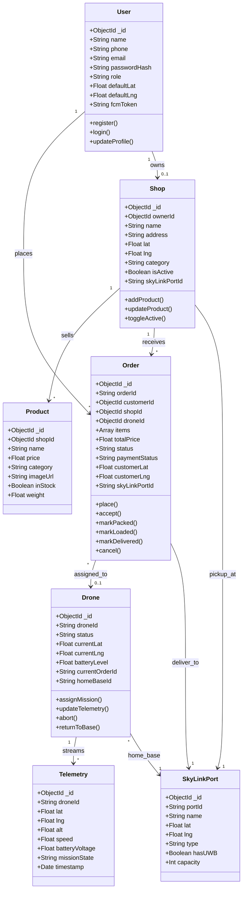

---

## 15. STATE MACHINE — ORDER STATES

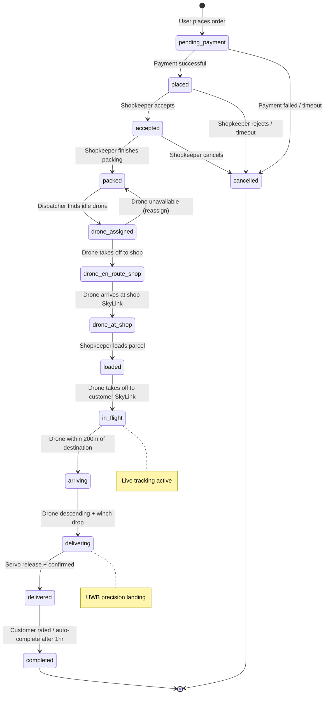

---

## 16. STATE MACHINE — DRONE STATES

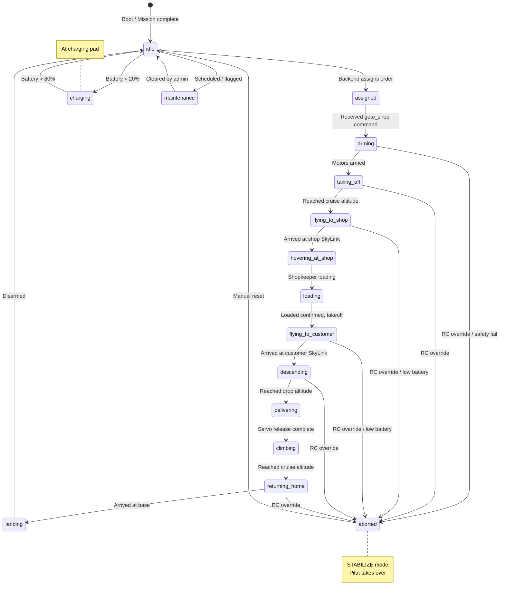

---

## 17. SECURITY ARCHITECTURE

### Authentication & Authorization

```
┌──────────────────────────────────────────────────────────┐
│                    SECURITY LAYERS                        │
├──────────────────────────────────────────────────────────┤
│                                                          │
│  1. HTTPS (TLS 1.3) — All traffic encrypted              │
│                                                          │
│  2. JWT Authentication                                    │
│     - Access Token (15min) + Refresh Token (7 days)      │
│     - Stored in HttpOnly cookie (web) / SecureStore (app)│
│                                                          │
│  3. Role-Based Access Control (RBAC)                     │
│     ┌────────────┬──────────────────────────────────┐    │
│     │   Role     │   Permissions                    │    │
│     ├────────────┼──────────────────────────────────┤    │
│     │ customer   │ Browse, order, track, pay        │    │
│     │ shopkeeper │ Manage shop, accept orders       │    │
│     │ admin      │ Fleet control, user mgmt, GCS    │    │
│     │ drone      │ Telemetry push only (API key)    │    │
│     └────────────┴──────────────────────────────────┘    │
│                                                          │
│  4. API Key for Drone ↔ Backend (MQTT + REST)            │
│     - Unique key per drone, rotated monthly              │
│                                                          │
│  5. Rate Limiting (Redis-based)                          │
│     - 100 req/min per user, 1000 req/min per shop        │
│                                                          │
│  6. Input Validation (Joi / Zod schemas on all routes)   │
│                                                          │
│  7. Geofence — Drone cannot fly outside 50km radius      │
│                                                          │
└──────────────────────────────────────────────────────────┘
```

---

## 18. SCALABILITY & FUTURE ROADMAP

### Phase 1 (Current → 3 months): MVP
- [x] Single drone delivery simulation
- [ ] Multi-shop catalog
- [ ] Real payment integration (Razorpay)
- [ ] Shopkeeper app
- [ ] MQTT-based real telemetry (replace HTTP polling)

### Phase 2 (3–6 months): Multi-Drone Fleet
- [ ] Fleet of 5-10 drones
- [ ] Automated dispatch algorithm
- [ ] Battery management & auto-charging
- [ ] SkyLink port UWB installation

### Phase 3 (6–12 months): City Scale
- [ ] 50+ drones, 100+ shops
- [ ] Split to microservices (Kubernetes)
- [ ] ML-based ETA prediction
- [ ] Dynamic pricing based on demand
- [ ] Regulatory compliance (DGCA India)

### Phase 4 (12+ months): Multi-City
- [ ] Multi-city deployment
- [ ] Franchise model for shops
- [ ] Drone-as-a-Service API for B2B
- [ ] Advanced autonomy (obstacle avoidance, VTOL transitions)

---

## QUICK REFERENCE — TECH STACK SUMMARY

| Component          | Technology                                  |
|--------------------|---------------------------------------------|
| **User App**       | React / React Native, Tailwind, Framer Motion|
| **Shopkeeper App** | React, Tailwind, Socket.io                  |
| **Admin GCS**      | React, Leaflet, Tailwind, Socket.io         |
| **Backend**        | Node.js, Express, Mongoose, Socket.io       |
| **Database**       | MongoDB Atlas (primary), Redis (geo + cache)|
| **MQTT Broker**    | Mosquitto / AWS IoT Core                    |
| **Drone Edge**     | Python, DroneKit, MAVLink, MQTT (paho)      |
| **Payment**        | Razorpay / Stripe                           |
| **Push Notif**     | Firebase Cloud Messaging (FCM)              |
| **Deployment**     | VPS (Render/Railway) → AWS ECS/K8s later    |
| **CI/CD**          | GitHub Actions                              |
| **Monitoring**     | Winston logs, Grafana + Prometheus (later)  |
