# 🔄 AURA DRONE DELIVERY — COMPLETE WORKFLOW
### *Every step, every stakeholder, every decision — from app open to package in hand*

---

## 1. THE BIG PICTURE — END TO END

```mermaid
graph LR
    A["👤 Customer<br/>Opens App"] --> B["🛒 Browse &<br/>Add to Cart"]
    B --> C["💳 Pay"]
    C --> D["🏪 Shopkeeper<br/>Gets Alert"]
    D --> E["📦 Pack<br/>Items"]
    E --> F["🚁 Drone<br/>Dispatched"]
    F --> G["🏪 Drone Picks<br/>from Shop"]
    G --> H["✈️ Drone Flies<br/>to Customer"]
    H --> I["📍 Drone Lands<br/>at SkyLink"]
    I --> J["📦 Package<br/>Dropped"]
    J --> K["👤 Customer<br/>Collects"]
    K --> L["🚁 Drone<br/>Returns Home"]
```

---

## 2. DETAILED WORKFLOW — EVERY STAKEHOLDER'S VIEW

### PHASE 1: CUSTOMER PLACES ORDER

```mermaid
flowchart TD
    START(("👤 Customer<br/>Opens App")) --> LOGIN{"Logged in?"}
    LOGIN -->|No| REG["Register / Login<br/>(Phone OTP)"]
    REG --> HOME
    LOGIN -->|Yes| HOME["🏠 Home Screen<br/>Shows nearby shops<br/>based on GPS location"]

    HOME --> BROWSE["🔍 Browse Shops<br/>Filter: Grocery, Medical,<br/>Tech, Food"]
    BROWSE --> SHOP["🏪 Select a Shop<br/>See products, prices,<br/>ratings, delivery time"]
    SHOP --> ADD["🛒 Add Items to Cart<br/>Select quantity<br/>See running total"]
    ADD --> MORE{"Add more<br/>items?"}
    MORE -->|Yes| SHOP
    MORE -->|No| CART["🛒 View Cart<br/>- Item list with qty<br/>- Subtotal<br/>- Delivery fee<br/>- Platform fee<br/>- Total amount"]

    CART --> SKYLINK["📍 Auto-Assign SkyLink Port<br/>Nearest port to customer's<br/>GPS location (Haversine)"]
    SKYLINK --> CONFIRM["Review Order<br/>- Items ✅<br/>- SkyLink pickup point ✅<br/>- Estimated delivery time ✅<br/>- Total price ✅"]

    CONFIRM --> PAY["💳 Payment<br/>- UPI (Google Pay, PhonePe)<br/>- Credit/Debit Card<br/>- Wallet"]
    PAY --> PAY_STATUS{"Payment<br/>Success?"}
    PAY_STATUS -->|Failed| PAY
    PAY_STATUS -->|Success| PLACED["✅ ORDER PLACED<br/>Order ID: AURA-XXXXXX<br/>Status: PLACED"]

    PLACED --> WAIT["⏳ Waiting Screen<br/>'Looking for your shop...'"]

    style START fill:#4CAF50,color:#fff
    style PLACED fill:#2196F3,color:#fff
    style SKYLINK fill:#FF9800,color:#fff
```

---

### PHASE 2: SHOPKEEPER RECEIVES & PREPARES ORDER

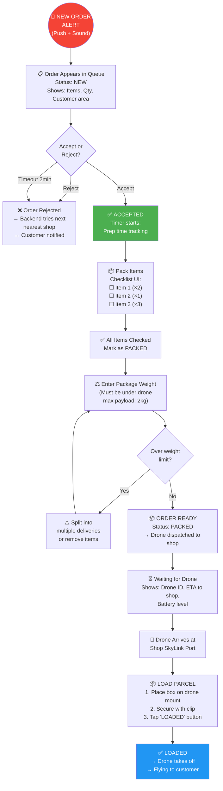

---

### PHASE 3: DRONE DISPATCH & ASSIGNMENT

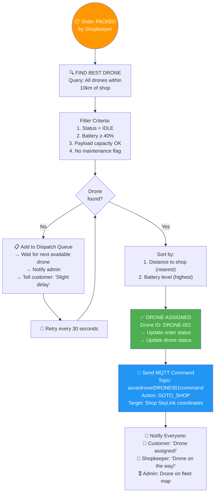

---

### PHASE 4: DRONE FLIGHT — SHOP PICKUP

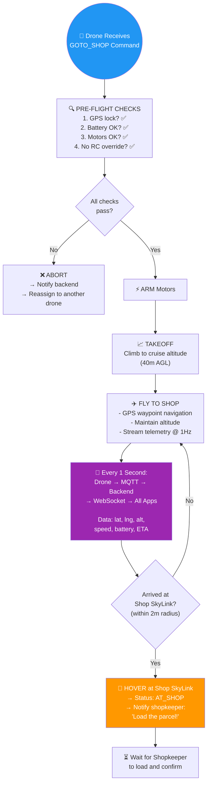

---

### PHASE 5: DRONE FLIGHT — DELIVERY TO CUSTOMER

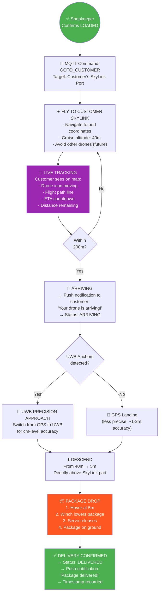

---

### PHASE 6: CUSTOMER COLLECTION & COMPLETION

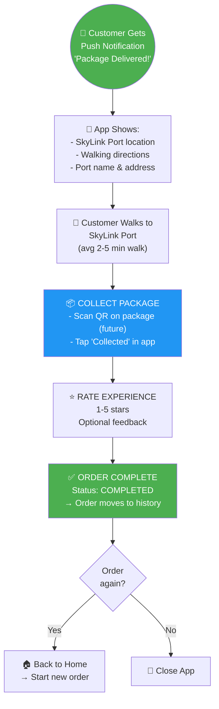

---

### PHASE 7: DRONE RETURN TO BASE

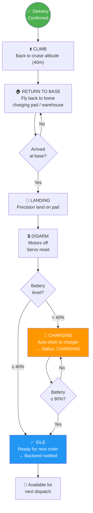

---

## 3. ADMIN (GCS) WORKFLOW — MONITORING EVERYTHING

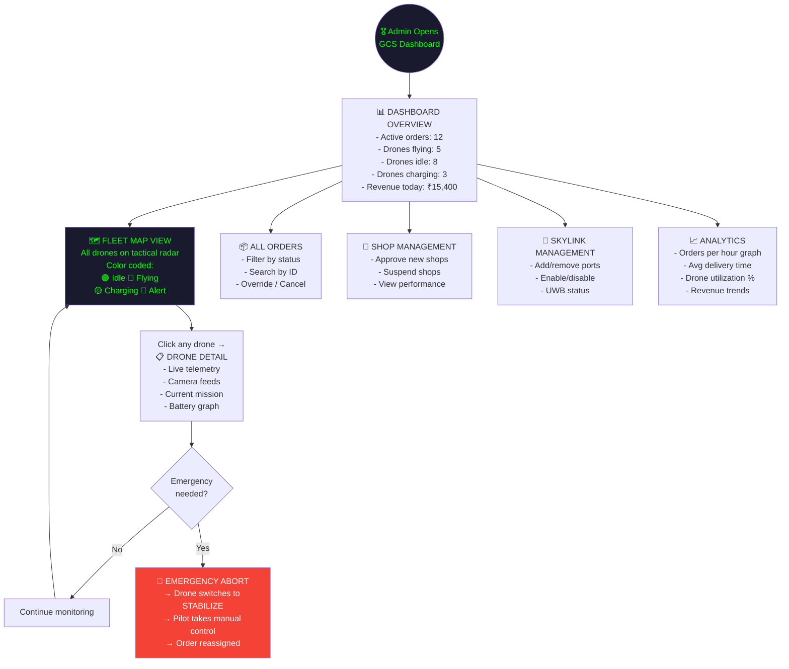

---

## 4. EDGE CASES & ERROR HANDLING WORKFLOW

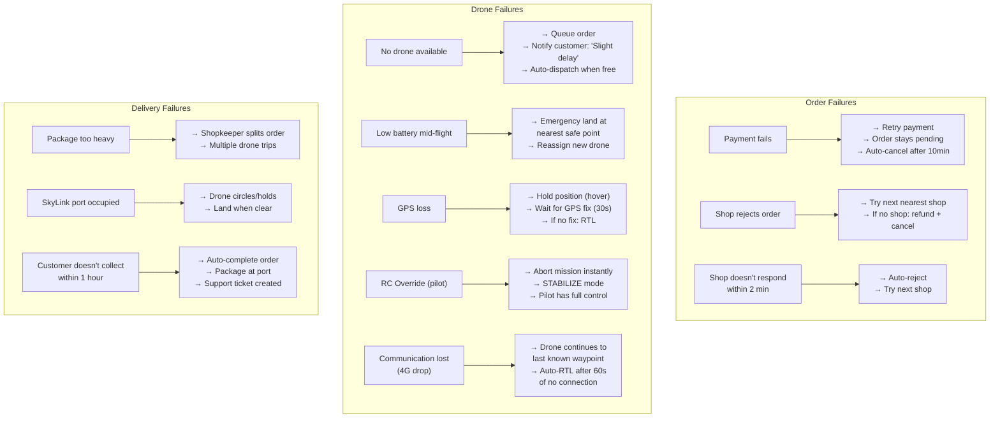

---

## 5. COMPLETE WORKFLOW — ONE SINGLE VIEW

This is the master diagram showing every stakeholder's actions in chronological order:

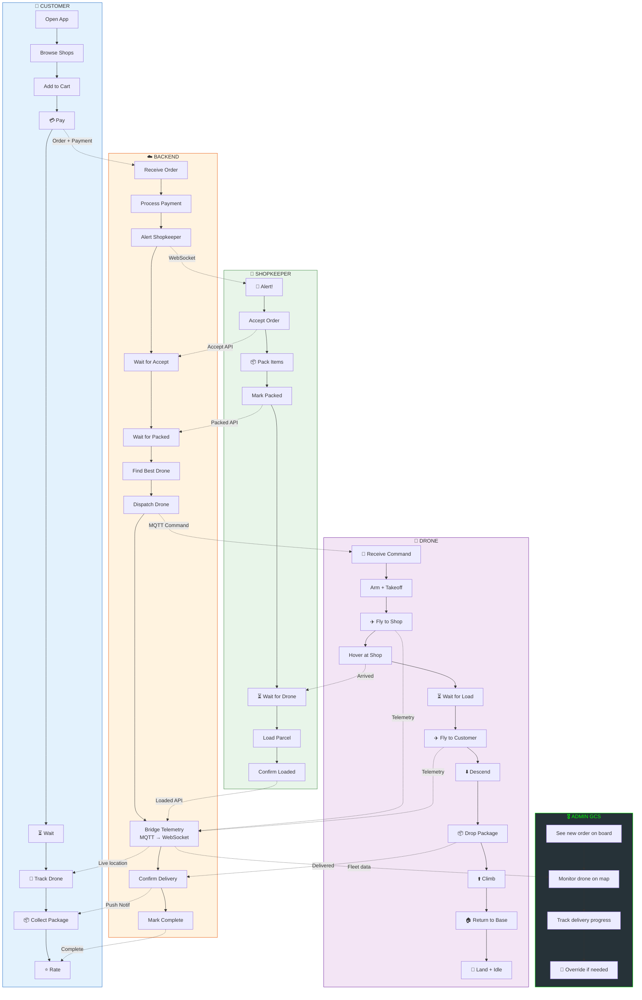

---

## 6. MONEY FLOW

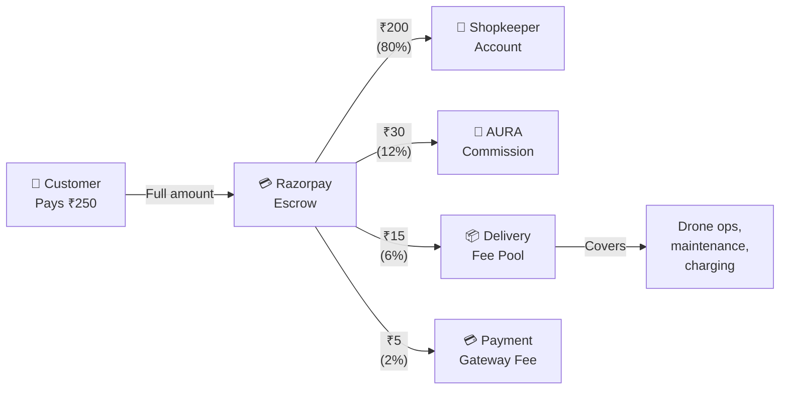

---

## 7. NOTIFICATION WORKFLOW

| Event | Who Gets Notified | Channel | Message |
|-------|-------------------|---------|---------|
| Order placed | Shopkeeper | Push + Sound + WebSocket | "🔔 New order! 3 items, ₹250" |
| Order accepted | Customer | Push + WebSocket | "✅ Shop accepted your order!" |
| Order packed | Customer | WebSocket | "📦 Your order is packed!" |
| Drone assigned | Customer + Shopkeeper | Push + WebSocket | "🚁 Drone DRONE-001 assigned!" |
| Drone en route to shop | Shopkeeper | WebSocket | "🚁 Drone arriving in 3 min" |
| Drone at shop | Shopkeeper | Push + Sound | "🚁 Drone is here! Load parcel" |
| Drone en route to customer | Customer | Push + WebSocket | "✈️ Drone is on its way!" |
| Drone arriving (200m) | Customer | Push + Sound | "📍 Drone arriving! Head to SkyLink" |
| Package delivered | Customer | Push + Sound | "📦 Package delivered! Collect now" |
| Low battery alert | Admin | WebSocket + Dashboard | "⚠️ DRONE-001 battery 25%" |
| Emergency abort | Admin | Push + Sound + Dashboard | "🚨 DRONE-001 ABORTED" |
| Customer doesn't collect (30min) | Customer | Push (reminder) | "📦 Your package is waiting!" |

---

## 8. TIME ESTIMATES (TYPICAL ORDER)

```
 0:00  ─── Customer places order & pays
 0:00  ─── Shopkeeper gets alert
 0:30  ─── Shopkeeper accepts                           ⏱️ 30 sec
 3:00  ─── Shopkeeper finishes packing                  ⏱️ 2.5 min
 3:00  ─── Drone dispatched
 5:00  ─── Drone arrives at shop (avg 2km)              ⏱️ 2 min
 5:30  ─── Shopkeeper loads parcel                      ⏱️ 30 sec
 5:30  ─── Drone takes off to customer
 8:30  ─── Drone arrives at customer SkyLink (avg 3km)  ⏱️ 3 min
 9:00  ─── Precision landing + package drop             ⏱️ 30 sec
 9:00  ─── ✅ DELIVERED
─────────────────────────────────────────────────
 TOTAL:  ~9 MINUTES (within 5km radius)
```

> **Compare:**  
> Blinkit: 10-15 min (bike, traffic dependent)  
> Rapido: 15-25 min (bike, traffic dependent)  
> **AURA: 8-12 min (drone, zero traffic)**
